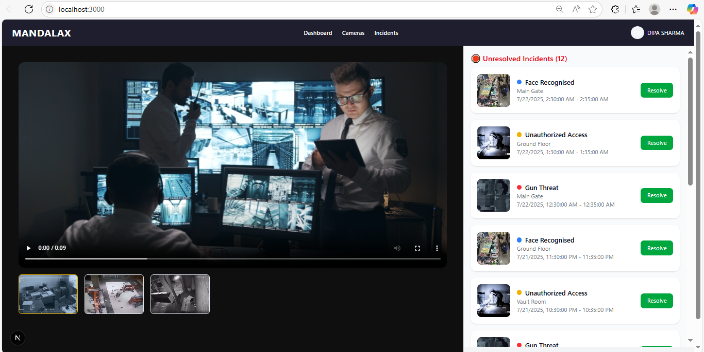
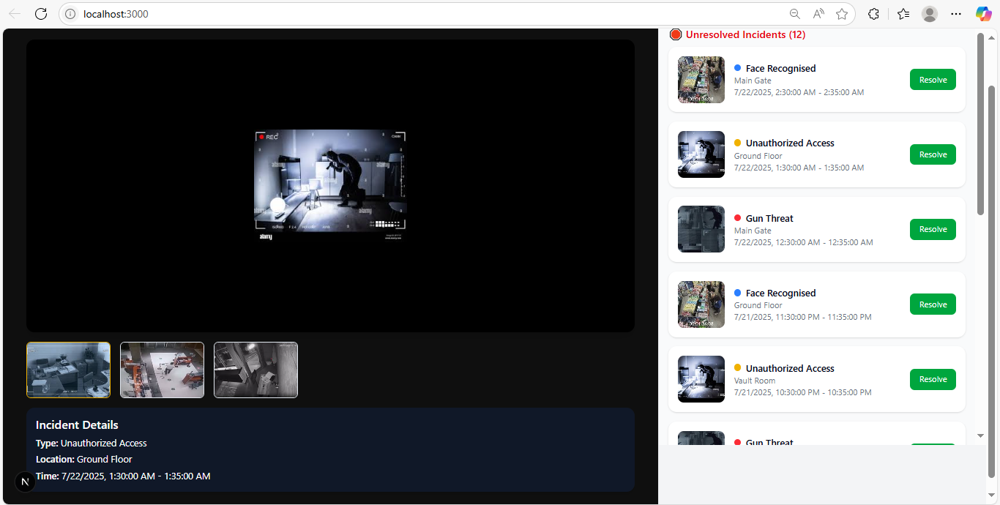

SCREENSHOTS:

## Preview





# SecureSight - CCTV Monitoring Dashboard

**SecureSight** is a frontend dashboard for a fictional CCTV monitoring system that displays detected security incidents like unauthorized access, gun threats, or facial recognition alerts. This dashboard uses computer vision outputs to help security teams monitor live footage and resolve incidents quickly.

---

##  Features

-  **Incident List**: View recent unresolved incidents with location, type, timestamp, and thumbnail.
-  **Incident Player**: Preview footage (default video or selected incident thumbnail).
-  **Resolve Incidents**: Optimistic UI for resolving incidents with smooth user experience.
-  **Live Count**: Shows number of unresolved incidents dynamically.
-  **Clean Layout**: Responsive split-view dashboard with a dark/light contrast layout.

---

##  Tech Stack

- **Framework**: [Next.js 15 (App Router)](https://nextjs.org)
- **Styling**: [TailwindCSS](https://tailwindcss.com)
- **Database**: [SQLite with Prisma ORM](https://www.prisma.io)
- **Deployment**: [Vercel](https://vercel.com)

---

## Seed Data

The seed script populates:

- 3 cameras (e.g., Shop Floor A, Vault, Entrance)
- 13 incidents across 3 types
- All thumbnails are `.jpg` images in `/public/thumbnails/`
- A default video is used at `/public/thumbnails/videos/camera1.mp4`

---

##  Local Development

1.  Clone the repository

```bash
git clone https://github.com/your-username/securesight-dashboard.git
cd securesight-dashboard

2. Install dependencies

npm install
3. Setup Environment
Create a .env file in the root and add:

DATABASE_URL="file:./dev.db"
4. Prisma setup

npx prisma migrate dev --name init
npx prisma db seed
Make sure prisma/seed.ts is defined in prisma.schema.

5. Run locally

npm run dev
Visit: http://localhost:3000
Developed By
DIPA SHARMA
